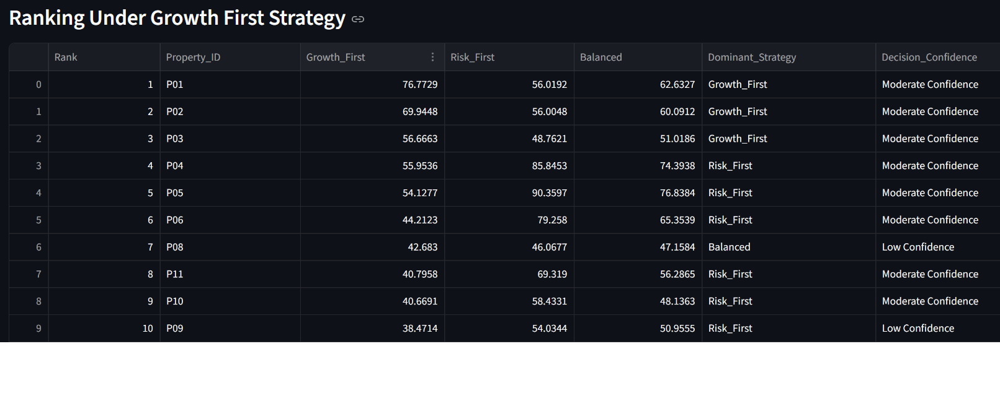
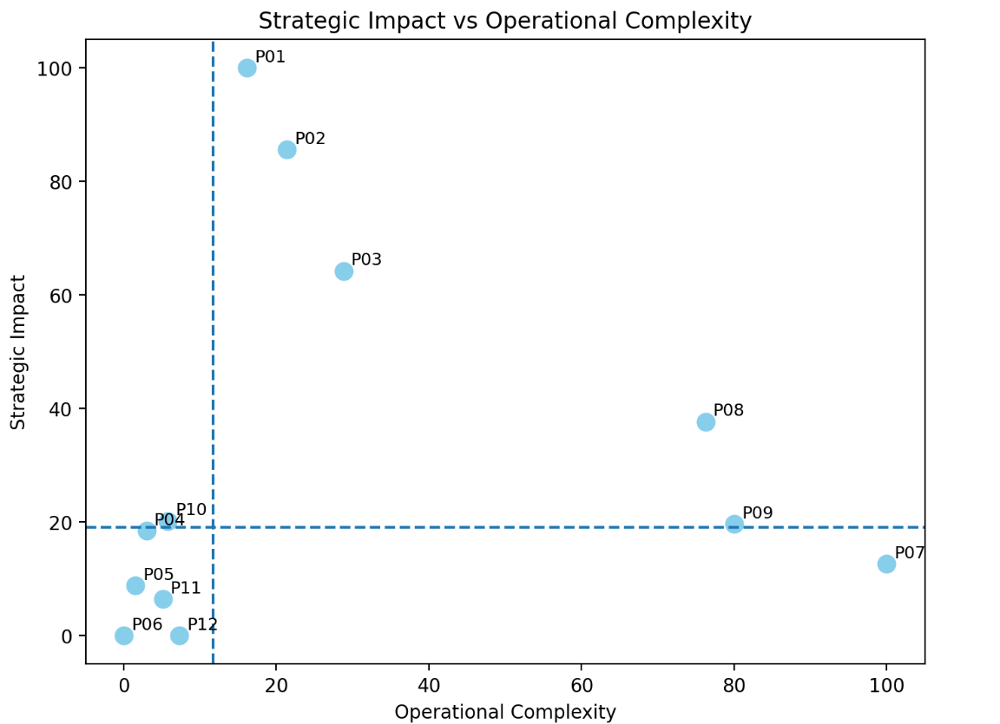
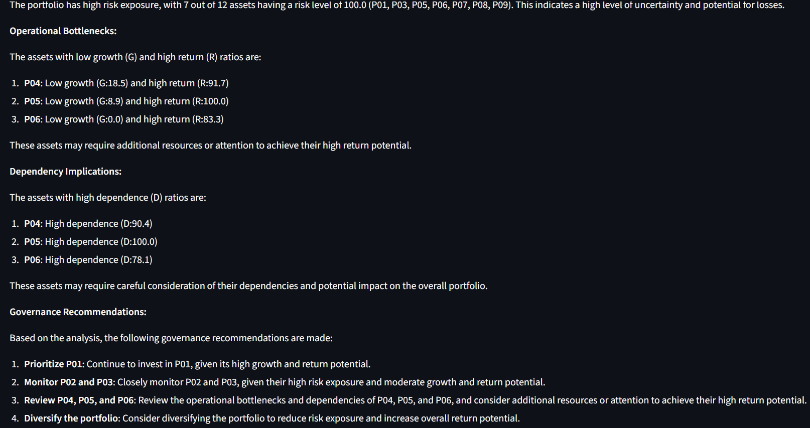

# 🚀 Portfolio Decision Intelligence Platform  
### Posture-Sensitive Strategy & Prioritization Engine

A decision intelligence system designed to help organizations prioritize initiatives under different strategic conditions — while explicitly surfacing trade-offs, constraints, and decision confidence.

---

## 🔍 Problem

Organizations rely heavily on dashboards and analytics, but still struggle to answer:

- Which initiatives should we prioritize right now?
- How do priorities change under different strategies?
- Where are hidden risks or bottlenecks?
- How confident can we be in this decision?

Traditional analytics provide visibility — but not **decision clarity**.

---

## 💡 Solution

This platform transforms multi-factor signals into **structured, strategy-aware prioritization**.

It does not automate decisions. Instead, it enables better decisions by:

- Showing how rankings shift under different strategic postures  
- Highlighting trade-offs across competing priorities  
- Identifying operational bottlenecks and dependencies  
- Quantifying decision confidence  
- Generating structured executive-level interpretations  

---

## 📈 Business Impact

- Converts analytics into decision-ready insights  
- Improves strategic alignment across teams  
- Reduces decision ambiguity in complex environments  
- Enables faster and more confident prioritization  
- Designed for high-stakes decision environments  

---

## 🧠 Core Capabilities

- Strategy-based prioritization (Growth / Risk / Balanced)
- Strategy sensitivity detection (Posture Delta)
- Predictive risk scoring (logistic regression)
- Resource allocation optimization under constraints
- Operational bottleneck identification
- Dependency graph modeling (critical path visibility)
- Deterministic executive decision brief
- AI-based strategic interpretation (Groq Llama 3.1)

---

## 🏗 System Architecture

### 1. Signal Layer
- Growth Score  
- Stability Score  
- Diversification Score  
- Rollover Score  
- Risk Score (predictive)

### 2. Strategy Layer
- Growth_First  
- Risk_First  
- Balanced  

### 3. Decision Layer
- Dominant Strategy Detection  
- Decision Confidence Scoring  
- Strategy Sensitivity (Posture Delta)

### 4. Optimization Layer
- Resource allocation under constraints  
- Portfolio selection based on strategy  

### 5. Insight Layer
- Operational bottleneck mapping  
- Dependency graph modeling  

### 6. Interpretation Layer
- Deterministic executive decision brief  
- AI-generated strategic narrative  

---

## 🔒 Design Principle

The system explicitly separates **decision logic from AI interpretation**.

- All prioritization logic is deterministic and auditable  
- AI does not influence or override decisions  
- AI is used only for structured explanation  

This ensures strong governance and makes the system suitable for **high-stakes environments such as healthcare, operations, and finance**.

---

## 📊 Sample Outputs

### Ranking & Strategy Prioritization


### Operational Bottleneck Identification


### AI Strategic Interpretation


---

## ⚙️ Tech Stack

- Python  
- Pandas, NumPy  
- Scikit-learn (Logistic Regression)  
- Streamlit  
- Matplotlib / Seaborn  
- NetworkX  
- PuLP (Optimization)  
- Groq API (Llama 3.1)  

---

## ▶️ How to Run

```bash
pip install -r requirements.txt
streamlit run app.py
